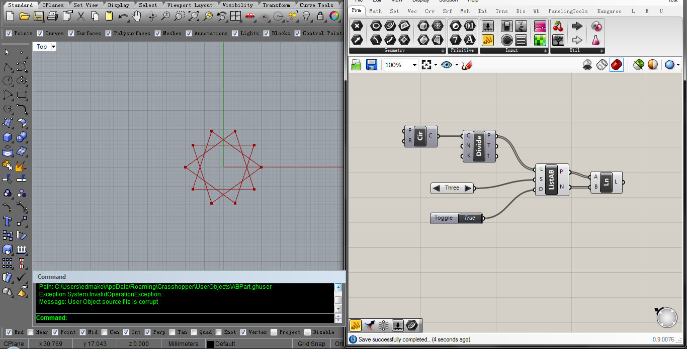

# 说明

两个在Grasshoper中经常用到的功能点，用常规的电池组合也可以做到。这里直接写了原生的Grasshopper电池进行实现

- RetrieveListAB
获得一个数列的两个子数列，一前一后，可指定偏移量。

- ShrinkDataTree
把一个树形数据掐头去尾，去掉最前、最后的Branch，以及每个Branch下最前、最后的元素。

如果rhino & grasshopper升级后导致DLL有问题，可使用assets下提供的DLL文件。

# 使用场景Demo
- RetrieveListAB

- ShrinktDataTree
场景太多了没有demo。

